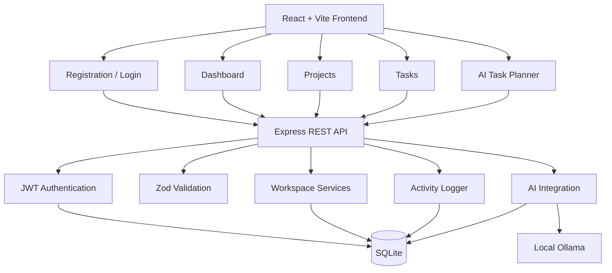
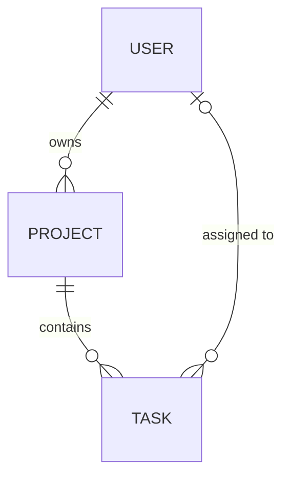

# ⚡ DevFlow

### AI-Powered Developer Execution Workspace

**A local-first workspace that connects projects, tasks, live progress, activity history and AI-assisted planning in one place.**

[](#-tech-stack)
[](#-persistent-relational-data-layer)
[](#-local-ai-assisted-task-planning)
[](#-internship-context)

<br/>

**Built as one connected product across the four Innovation Hacks Full Stack Development Internship tasks.**

---

## 🎓 Internship Context

DevFlow was developed for the **Innovation Hacks Full Stack Development Internship**, which consisted of four progressive tasks:

| Task | Focus |
|---|---|
| Task 1 | Developer Productivity Dashboard |
| Task 2 | Users / Projects / Tasks REST API |
| Task 3 | Persistent Relational Data Layer |
| Task 4 | AI-Powered Project & Task Management Platform |

Rather than delivering four disconnected assignments, each task was built as a layer of the same product: **interface → API → persistence → AI-assisted execution.**

---

## 🚀 What DevFlow Does

Developers and small teams frequently lose time because project execution is fragmented across:

- task lists
- project notes
- status updates
- deadlines
- progress tracking
- activity history
- separate AI tools

That fragmentation makes simple questions harder than they should be:

```text
What am I working on?
What is blocked?
What is already complete?
What should I work on next?
What changed recently?
Can AI help me break a project into actionable work
without sending project context to a cloud service?
```

**DevFlow treats this as an execution-context problem, not just a to-do list problem.**

It brings projects, tasks, progress, activity history and local AI planning into one lightweight workspace.

---

## 🖥️ Product at a Glance

| Platform Signal | Result |
|---|---:|
| Internship tasks unified into one product | **4** |
| Final platform API endpoints | **14** |
| Task workflow states | **3** (Todo / In Progress / Done) |
| Authentication | **JWT + bcrypt** |
| Persistence | **SQLite, file-backed** |
| AI runtime | **Local Ollama** |
| Cloud AI API required | **None** |

> Everything runs locally: no paid AI API, no external database service, and a reproducible setup through `.env.example`.

---

## 🧭 Four-Task Engineering Journey

```text
┌──────────────────────────────────────┐
│ TASK 1                               │
│ Developer Productivity Dashboard     │
└──────────────────┬───────────────────┘
                   ↓
┌──────────────────────────────────────┐
│ TASK 2                               │
│ Users / Projects / Tasks REST API    │
└──────────────────┬───────────────────┘
                   ↓
┌──────────────────────────────────────┐
│ TASK 3                               │
│ Persistent Relational Data Layer     │
└──────────────────┬───────────────────┘
                   ↓
┌──────────────────────────────────────┐
│ TASK 4                               │
│ AI-Powered Full-Stack Platform       │
└──────────────────────────────────────┘
```

### 01: 🖥️ Developer Productivity Dashboard

**Frontend foundation.** Established the product interface and reusable component system.

- dashboard / landing page
- navigation and user profile section
- project cards and task views
- progress indicators
- search and filtering
- loading and empty states
- responsive desktop / tablet / mobile behavior
- reusable React component architecture

### 02:🔌 Users, Projects & Tasks REST API

**Backend foundation.** Introduced the API contract used by every later stage.

```text
Users     GET  /api/users            GET  /api/users/:id
          POST /api/users            PATCH /api/users/:id
          DELETE /api/users/:id

Projects  GET  /api/projects         GET  /api/projects/:id
          POST /api/projects         PATCH /api/projects/:id
          DELETE /api/projects/:id

Tasks     GET  /api/tasks            GET  /api/tasks/:id
          POST /api/tasks            PATCH /api/tasks/:id
          PATCH /api/tasks/:id/status
          DELETE /api/tasks/:id
```

Engineering included:

- RESTful resource design
- Zod request validation
- centralized error handling
- meaningful HTTP status codes
- structured JSON responses
- query-based search and filtering
- environment configuration
- API examples and documentation

### 03: 🗄️ Persistent Relational Data Layer

**From temporary data to real persistence.** Replaced in-memory data with a relational SQLite database.

```text
Express REST API
       |
       v
Node.js Database Layer
       |
       v
SQLite
       |
       v
users / projects / tasks
```

**Persistence proof:**

```text
Create data -> Stop server -> Restart server -> Data still exists
```

### 04: 🤖 AI-Powered Project & Task Management Platform

**Full-stack integration.** Brought every previous layer together with authentication, live analytics, activity tracking and local AI.

```text
React + Vite
      |
      v
Protected Frontend
      |
      v
Express REST API
      |
      v
JWT + Zod Validation
      |
      v
SQLite  +  Local Ollama AI
```

---

## 🔄 Execution Workflow

DevFlow connects planning to execution so context is never lost between steps.

```text
Projects
      |
      v
Tasks + Priorities + Due Dates
      |
      v
Execution Status  (Todo -> In Progress -> Done)
      |
      v
Live Progress
      |
      v
Activity History
      |
      v
AI-Assisted Planning
      |
      +------ Generated tasks saved back into the project
```

**Design principle:** AI output should become part of the project, not disposable chat text.

---

## 🔐 Authentication & Data Isolation

```text
Credentials
      |
      v
bcrypt verification
      |
      v
JWT issued
      |
      v
Protected workspace
```

DevFlow includes:

- registration, login and logout
- bcrypt password hashing
- JWT token issuance
- protected API endpoints
- protected frontend routes
- authenticated user data isolation

---

## 📁 Project Management

Users can:

- create, edit and delete projects
- view project details
- update project status
- inspect task totals
- track completion percentage

---

## ✅ Task Management

Each task carries:

- project association
- title and description
- priority
- due date
- status: **Todo**, **In Progress** or **Done**

Supported operations:

- search
- status filtering
- priority filtering
- persisted updates
- deletion

---

## 📊 Live Progress Tracking

Dashboard metrics are calculated from backend data, not hard-coded in the interface:

- Active Projects
- Total Tasks
- Completed Tasks
- In-Progress Tasks

Project completion is derived directly from task state:

```text
Completion % = Completed Tasks / Total Project Tasks
```

Changing a task's status therefore updates **both** the dashboard statistics and the project's completion percentage.

---

## 🕒 Workspace Activity

DevFlow keeps a persistent trail of meaningful actions:

- account creation and login
- project creation, update and deletion
- task creation, update and deletion
- AI generation

Authentication, project, task and AI events all feed one persistent activity timeline.

---

## 🧠 Local AI-Assisted Task Planning

DevFlow turns project context into actionable engineering tasks.

```text
Project Name
      +
Project Description
      |
      v
Planning Prompt
      |
      v
Local Ollama Model
      |
      v
Structured Task Suggestions
      |
      v
SQLite
      |
      v
Project Dashboard
```

Default configuration:

```env
OLLAMA_URL=http://localhost:11434
OLLAMA_MODEL=llama3.2:3b
```

Generated tasks are **saved into the project** rather than shown as disposable chat output.

### Failure-Safe AI Design

If Ollama is unavailable, the product remains usable, and it says so.

| Ollama State | Result Label | Behavior |
|---|---|---|
| Reachable | `LOCAL AI` | Tasks generated by the local model and saved to the project |
| Unavailable | `FALLBACK PLANNER` | Deterministic fallback tasks saved and explicitly labelled |

**Deterministic fallback output is never silently presented as AI-generated content.**

---

## 🏗️ Architecture



---

## 🗄️ Persistent Relational Data Layer



```text
User
 ├── owns many Projects
 └── may be assigned many Tasks

Project
 ├── belongs to one User
 └── contains many Tasks

Task
 ├── belongs to one Project
 └── may belong to one User
```

Database engineering:

- primary keys
- unique email constraint
- foreign-key relationships
- project → task cascade deletion
- task status and priority constraints
- schema-level checks
- indexes
- file-backed storage with an environment-configured database path

---

## ⚙️ Key Engineering Decisions

| Challenge | DevFlow Approach |
|---|---|
| Plain-text passwords are unsafe | bcrypt password hashing |
| Private routes need identity | JWT authentication |
| Invalid writes can corrupt state | Zod validation + SQLite constraints |
| Frontend data must stay current | API-backed state refresh after mutations |
| Project/task relations must stay valid | Foreign keys with cascade deletion |
| Data should survive restarts | File-backed SQLite persistence |
| AI should not require a paid cloud API | Local Ollama model |
| AI failure should not break the product | Explicit, labelled fallback planner |
| User actions should be traceable | Persistent recent-activity timeline |
| Setup should stay reproducible | Local-first dependencies and `.env.example` |

---

## 🛠️ Tech Stack

| Layer | Technology |
|---|---|
| Frontend | React 18, Vite |
| Routing | React Router |
| Styling | Custom responsive CSS |
| Icons | Lucide React |
| Backend | Node.js, Express |
| Validation | Zod |
| Authentication | JWT |
| Password Security | bcryptjs |
| Database | SQLite via Node's built-in `node:sqlite` |
| AI | Ollama (local model) |
| API Style | REST |
| Configuration | dotenv |
| Production Path | PostgreSQL, automated tests, CI/CD, cloud deployment |

---

## 📡 API Surface

### Authentication

| Method | Endpoint | Purpose |
|---|---|---|
| `POST` | `/api/auth/register` | Create an account |
| `POST` | `/api/auth/login` | Authenticate and receive a JWT |
| `GET` | `/api/auth/me` | Current authenticated user |

### Dashboard

| Method | Endpoint | Purpose |
|---|---|---|
| `GET` | `/api/dashboard` | Live workspace statistics |

### Projects

| Method | Endpoint | Purpose |
|---|---|---|
| `GET` | `/api/projects` | List projects |
| `GET` | `/api/projects/:id` | Project details and task totals |
| `POST` | `/api/projects` | Create a project |
| `PATCH` | `/api/projects/:id` | Update a project |
| `DELETE` | `/api/projects/:id` | Delete a project and its tasks |

### Tasks

| Method | Endpoint | Purpose |
|---|---|---|
| `GET` | `/api/tasks` | List, search and filter tasks |
| `POST` | `/api/tasks` | Create a task |
| `PATCH` | `/api/tasks/:id` | Update a task or its status |
| `DELETE` | `/api/tasks/:id` | Delete a task |

### AI

| Method | Endpoint | Purpose |
|---|---|---|
| `POST` | `/api/ai/generate-tasks` | Generate and save tasks from project context |

---

## 📁 Repository Structure

```text
Innovation-Hacks/
├── Task1/
│   └── dashboard/
│
├── Task2/
│   └── users-projects-tasks-api/
│
├── Task3/
│   └── persistent-data-layer/
│
├── Task4/
│   └── ai-project-management-platform/
│       ├── backend/
│       └── frontend/
│
├── devflow-readme-assets/
├── package.json
└── README.md
```

---

## ⚙️ Running Locally

### Requirements

```text
Node.js 22.13+  (uses the built-in node:sqlite module)
npm
Ollama          (optional, for real local AI)
```

### 1. Clone the Repository

```bash
git clone https://github.com/agcodes0315/Innovation-Hacks.git
cd Innovation-Hacks
```

### 2. Install Dependencies (first time only)

```bash
npm install
npm --prefix "Task1/dashboard" install
npm --prefix "Task2/users-projects-tasks-api" install
npm --prefix "Task3/persistent-data-layer" install
npm --prefix "Task4/ai-project-management-platform/backend" install
npm --prefix "Task4/ai-project-management-platform/frontend" install
```

### 3. Run Everything With One Command

```bash
npm run dev
```

| Component | URL |
|---|---|
| Task 1 Dashboard | http://localhost:5173 |
| Task 2 API | http://localhost:4002/api/health |
| Task 3 Persistent API | http://localhost:4003/api/health |
| **Task 4 Frontend (final product)** | **http://localhost:5174** |
| Task 4 Backend | http://localhost:4004/api/health |

Stop everything with `Ctrl + C`.

---

## 🤖 Enable the Real Local AI

```bash
ollama pull llama3.2:3b
ollama serve
```

Verify Ollama is reachable:

```bash
curl http://localhost:11434/api/tags
```

Then open a project in DevFlow and click **AI Generate**. The result is labelled `LOCAL AI` when the model responds, and `FALLBACK PLANNER` when it does not.

---

## 🌱 Roadmap

```text
Phase 1: Collaboration
Explicit task assignee selector
Multi-user project collaboration
Workload view

Phase 2: Awareness
Calendar and deadline view
Overdue-task detection
Notifications
Security alerts
Dedicated audit-log page

Phase 3: Smarter Planning
AI task prioritization
AI project summary
AI productivity suggestions

Phase 4: Production Readiness
Automated tests
CI/CD
Cloud deployment
PostgreSQL production data layer
```

---

## 🎯 What This Project Demonstrates

DevFlow brings together several engineering concerns:

- frontend engineering and responsive UI design
- React component architecture
- REST API design
- request validation and centralized errors
- relational data modelling
- persistent storage
- authentication, password security and protected routes
- project and task CRUD
- search, filtering and live analytics
- activity tracking
- local AI integration with graceful failure handling
- full-stack system integration

---

## ⚠️ Scope

DevFlow is an **internship-scale full-stack product and local development prototype**.

SQLite keeps the project free, reproducible, persistent and independent of external database services. For a larger multi-instance production deployment, the same data model could be migrated to PostgreSQL.

---

## 👩‍💻 Author

### Agrima Saxena

**Full-Stack Development · Applied AI · Backend Systems · Software Engineering**

<table>
<tr>

<td width="60">
<a href="https://www.linkedin.com/in/agrima-saxena-142960426/" title="LinkedIn">

</a>
</td>

<td width="60">
<a href="mailto:agrimalc@gmail.com" title="Email">

</a>
</td>

<td width="60">
<a href="https://github.com/agcodes0315" title="GitHub">

</a>
</td>

</tr>
</table>

<a href="https://github.com/agcodes0315/Innovation-Hacks">

</a>

*Built for the Innovation Hacks Full Stack Development Internship.*


