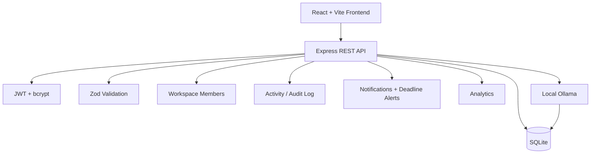

# ⚡ DevFlow

## AI-Powered Developer Execution Workspace

> **A local-first workspace that unifies project planning, task ownership, deadlines, progress, activity history, alerts, analytics, and AI-assisted execution.**

DevFlow was built as one connected product across the four **Innovation Hacks Full Stack Development Internship** tasks.

---

# 🌍 The Real-World Problem

Developers and small teams often split execution across too many places: notes, task lists, calendars, project trackers, status updates, and separate AI tools.

That creates unnecessary context switching and makes basic questions harder to answer:

```text
What should I work on now?
Who owns this task?
What is overdue?
How far along is this project?
What changed recently?
What needs attention?
Can AI break this project into actionable work locally?
```

## 💡 DevFlow's Approach

DevFlow treats this as an **execution-context problem**, not just a to-do-list problem.

```text
Projects
   ↓
Assigned Tasks + Priorities + Due Dates
   ↓
Todo → In Progress → Done
   ↓
Live Progress + Analytics
   ↓
Activity History + Alerts
   ↓
Local AI-Assisted Planning
```

---

# 🎓 Four-Task Internship Journey

| Task | Deliverable | DevFlow Implementation |
|---|---|---|
| **01** | Developer Productivity Dashboard | React/Vite responsive productivity UI |
| **02** | Users, Projects & Tasks REST API | Express + Zod REST backend |
| **03** | Persistent Data Layer | SQLite relational persistence |
| **04** | AI-Powered Full-Stack Platform | Auth + CRUD + assignments + analytics + local AI |

Rather than shipping four disconnected assignments, each task became the next layer of the same product:

```text
Interface → API → Persistence → AI-Powered Full Stack Product
```

---

# 01 · 🖥️ Developer Productivity Dashboard

Task 1 established the frontend foundation.

### Implemented

- dashboard / primary landing page
- accessible sidebar navigation
- user/profile section
- project cards
- task views
- progress indicators
- search
- filtering
- loading and empty states
- focus timer
- analytics view
- calendar view
- responsive desktop/tablet/mobile behavior
- reusable React components

---

# 02 · 🔌 Users, Projects & Tasks REST API

Task 2 introduced the application backend.

## Users

```text
GET     /api/users
GET     /api/users/:id
POST    /api/users
PATCH   /api/users/:id
DELETE  /api/users/:id
```

## Projects

```text
GET     /api/projects
GET     /api/projects/:id
POST    /api/projects
PATCH   /api/projects/:id
DELETE  /api/projects/:id
```

## Tasks

```text
GET     /api/tasks
GET     /api/tasks/:id
POST    /api/tasks
PATCH   /api/tasks/:id
PATCH   /api/tasks/:id/status
DELETE  /api/tasks/:id
```

### Backend Engineering

- RESTful endpoint design
- Zod request validation
- centralized error handling
- meaningful HTTP status codes
- structured JSON responses
- search/filter query support
- environment configuration

---

# 03 · 🗄️ Persistent Relational Data Layer

Task 3 moves from temporary data to real persistence.

```text
Express REST API
       ↓
Node.js Data Layer
       ↓
SQLite
       ↓
Users / Projects / Tasks
```

### Data Model

```text
User
 ├── owns Projects
 └── can participate in task workflows

Project
 ├── belongs to a User
 └── contains Tasks

Task
 ├── belongs to a Project
 └── persists status / priority / due date
```

### Persistence Features

- primary keys
- unique email constraint
- foreign keys
- cascade behavior
- task status constraints
- priority constraints
- indexes
- schema-level validation
- persistent file-backed storage

### Persistence Proof

```text
Create data → Stop server → Restart server → Data still exists
```

---

# 04 · 🤖 AI-Powered Project & Task Management Platform

Task 4 combines the previous layers into the final full-stack product.

## 🔐 Authentication

- registration
- login
- logout
- bcrypt password hashing
- JWT authentication
- protected frontend routes
- protected backend routes
- authenticated workspace isolation

## 📁 Project Management

- create projects
- view project details
- edit projects
- delete projects
- project status
- project task totals
- live completion percentage

## ✅ Task Management

- create tasks
- explicit assignee selection
- workspace members
- priority
- due date
- Todo / In Progress / Done
- search
- status filtering
- priority filtering
- assignment updates
- persisted edits
- delete tasks
- overdue detection

## 📊 Analytics

- completed task count
- in-progress task count
- overdue task count
- active project count
- task status distribution
- priority distribution
- workload by assignee

## 📅 Calendar & Deadlines

Tasks with due dates appear in a dedicated deadline view, with overdue work highlighted.

## 🕒 Activity & Audit Log

DevFlow records meaningful workspace events such as:

- account creation
- login
- project creation/update/deletion
- member creation
- task creation/update/deletion
- AI task generation

This gives the application a persistent operational history rather than only showing current state.

## 🔔 Notifications & Alerts

DevFlow surfaces:

- welcome notifications
- project-created events
- completed-task notices
- overdue-task alerts
- local-AI availability warnings
- successful AI plan generation

---

# 🧠 Local AI-Assisted Task Planning

DevFlow converts project context into actionable project tasks.

```text
Project Name + Description
          ↓
Planning Prompt
          ↓
Local Ollama Model
          ↓
Structured Tasks
          ↓
SQLite
          ↓
Project Workspace
```

Default local configuration:

```env
OLLAMA_URL=http://localhost:11434
OLLAMA_MODEL=llama3.2:3b
```

### Honest Failure Handling

| Ollama state | UI label | Behavior |
|---|---|---|
| Available | `LOCAL AI` | Local model generates tasks |
| Unavailable | `FALLBACK PLANNER` | Deterministic fallback plan is clearly labelled |

Fallback output is never silently presented as AI-generated content.

---

# 🏗️ Architecture



---

# 🛡️ Key Engineering Decisions

| Challenge | DevFlow approach |
|---|---|
| Password security | bcrypt hashing |
| Protected application data | JWT authentication |
| Invalid writes | Zod + SQLite constraints |
| Durable state | SQLite persistence |
| Visible task ownership | Workspace members + assignee selector |
| Deadline awareness | Due dates + overdue detection |
| Traceability | Activity & Audit Log |
| Important changes | Notifications / alerts |
| Paid AI dependency | Local Ollama |
| AI outage | Explicit fallback planner |
| Local setup complexity | No external DB service required |
| Legacy local database changes | Automatic non-destructive SQLite migration |

---

# 🛠️ Tech Stack

| Layer | Technology |
|---|---|
| Frontend | React 18 + Vite |
| Routing | React Router |
| Styling | Custom responsive CSS |
| Icons | Lucide React |
| Backend | Node.js + Express |
| Validation | Zod |
| Authentication | JWT |
| Password hashing | bcryptjs |
| Database | SQLite via `node:sqlite` |
| AI | Ollama local model |
| Configuration | dotenv / environment variables |
| API style | REST |

---

# 📡 Final Task 4 API Surface

## Authentication

| Method | Endpoint | Purpose |
|---|---|---|
| `POST` | `/api/auth/register` | Create account |
| `POST` | `/api/auth/login` | Authenticate user |
| `GET` | `/api/auth/me` | Current authenticated profile |

## Dashboard

| Method | Endpoint | Purpose |
|---|---|---|
| `GET` | `/api/dashboard` | Workspace statistics and recent activity |

## Members

| Method | Endpoint | Purpose |
|---|---|---|
| `GET` | `/api/members` | Workspace assignees |
| `POST` | `/api/members` | Add workspace member |

## Projects

| Method | Endpoint | Purpose |
|---|---|---|
| `GET` | `/api/projects` | List/search projects |
| `GET` | `/api/projects/:id` | Project details and tasks |
| `POST` | `/api/projects` | Create project |
| `PATCH` | `/api/projects/:id` | Update project |
| `DELETE` | `/api/projects/:id` | Delete project |

## Tasks

| Method | Endpoint | Purpose |
|---|---|---|
| `GET` | `/api/tasks` | Search/filter tasks |
| `POST` | `/api/tasks` | Create task |
| `PATCH` | `/api/tasks/:id` | Update assignment/status/priority/etc. |
| `DELETE` | `/api/tasks/:id` | Delete task |

## Product Intelligence

| Method | Endpoint | Purpose |
|---|---|---|
| `GET` | `/api/activity` | Activity / audit history |
| `GET` | `/api/notifications` | Alerts and notifications |
| `PATCH` | `/api/notifications/:id/read` | Mark notification read |
| `GET` | `/api/analytics` | Status/priority/workload analytics |

## AI

| Method | Endpoint | Purpose |
|---|---|---|
| `POST` | `/api/ai/generate-tasks` | Generate and persist project tasks |

---

# 📁 Repository Structure

The repository root intentionally stays simple:

```text
Innovation-Hacks/
├── Task1/
├── Task2/
├── Task3/
├── Task4/
├── .gitignore
├── package-lock.json
├── package.json
└── README.md
```

No extra `START_HERE.md` files are required.

---

# ▶️ Run the Entire Project

## Requirements

```text
Node.js 22.5+
npm
Ollama (optional for genuine local AI)
```

## First Time Only

From the repository root:

```powershell
npm install
```

The root project uses npm workspaces, so the install covers Task 1, Task 2, Task 3, Task 4 backend, and Task 4 frontend.

## Every Time After That

```powershell
npm run dev
```

### Development URLs

| Component | URL |
|---|---|
| Task 1 Dashboard | `http://localhost:5173` |
| Task 2 API | `http://localhost:4002/api/health` |
| Task 3 Persistent API | `http://localhost:4003/api/health` |
| **Task 4 Final Product** | **`http://localhost:5174`** |
| Task 4 Backend | `http://localhost:4004/api/health` |

Stop everything with:

```text
Ctrl + C
```

If an old Vite/Node process is holding a port on Windows, run:

```powershell
Get-Process node -ErrorAction SilentlyContinue | Stop-Process -Force
npm run dev
```

---

# 🤖 Enable Genuine Local AI

```powershell
ollama pull llama3.2:3b
ollama serve
```

Verify:

```powershell
Invoke-RestMethod http://localhost:11434/api/tags
```

Then open Task 4 → Projects → **AI Generate**.

---

# 🧪 Recommended Final Test

1. Register a new account.
2. Create a project.
3. Add a workspace member.
4. Create tasks and assign them.
5. Set priorities and due dates.
6. Move tasks through Todo → In Progress → Done.
7. Check dashboard progress updates.
8. Test search and filters.
9. Open Analytics.
10. Open Calendar & Deadlines.
11. Check Activity & Audit Log.
12. Check Notifications & Alerts.
13. Run Ollama and generate project tasks.
14. Stop the backend.
15. Restart with `npm run dev`.
16. Confirm projects/tasks/account data still exist.

---

# 🌱 Production Roadmap

- richer multi-user collaboration
- invitation workflow
- role-based access control
- comments and task discussions
- file attachments
- push/email notifications
- automated testing
- CI/CD
- deployment
- PostgreSQL migration for multi-instance production
- AI prioritization
- AI project summaries
- productivity suggestions

---

# ⚠️ Scope

DevFlow is an internship-scale full-stack product and local development prototype.

SQLite keeps the application free, reproducible, persistent, and easy to run without an external database service. A larger distributed deployment would typically migrate the relational model to PostgreSQL or another server-managed database.

---

# 👩‍💻 Author

## Agrima Saxena

**Full-Stack Development · Backend Systems · Applied AI · Software Engineering**

[](https://www.linkedin.com/in/agrima-saxena-142960426/)
[](https://github.com/agcodes0315)

---

## Build. Innovate. Impact.

**DevFlow turns four internship assignments into one connected engineering product: interface → API → persistence → AI-assisted execution.**
