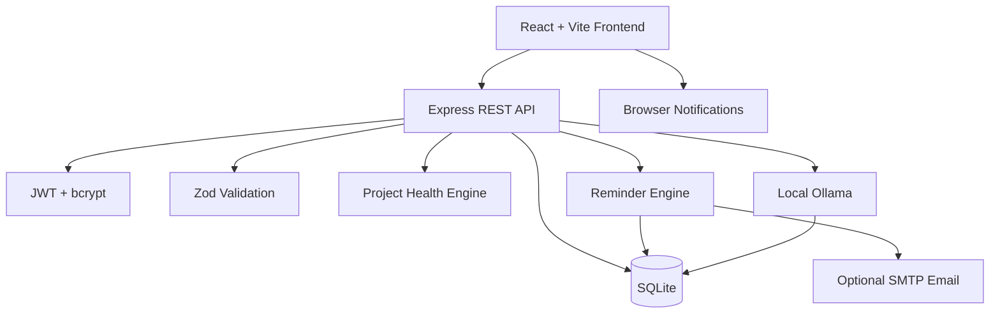

# ⚡ DevFlow

## Developer Execution Intelligence: Projects, Risk, Reminders & Local AI

> **A local-first full-stack workspace that helps developers turn project plans into execution, detect delivery risk early, and act before deadlines become failures.**

[](#-tech-stack)
[](#-tech-stack)
[](#-persistent-data-layer)
[](#-local-ai)
[](#-internship-task-progression)

---

# 🌍 The Problem DevFlow Solves

Modern software teams rarely fail because they lack a task list. They fail because execution context is scattered.

A developer may know what needs to be built, but still lack a clear answer to questions such as:

- Which task is actually blocking delivery?
- Which deadline is becoming risky?
- Which project is unhealthy before it becomes late?
- Who is overloaded?
- Which in-progress task has quietly gone stale?
- What should be worked on next?
- How can a project manager understand delivery health without manually reading every task?
- How can AI help without becoming the source of truth?

Typical project tools record work. DevFlow is designed to **interpret execution signals** around that work, a single workspace covering:

```text
planning → ownership → dependencies → execution → risk detection → reminders → AI-assisted action
```

## 💡 Core Product Idea

```text
Project Context
      ↓
Tasks + Assignees + Priorities + Deadlines
      ↓
Dependencies / Blockers
      ↓
Todo → In Progress → Done
      ↓
Deterministic Risk Signals
      ↓
Project Health + Workload Intelligence
      ↓
In-App + Browser + Optional Email Reminders
      ↓
Local AI Explanation & Planning
```

The key design principle is simple:

> **Deterministic systems identify risk. AI explains and assists — it does not invent the underlying score.**

That separation is intentional. Project-health signals are calculated from real workspace data; the local AI layer is then used to explain those signals, generate project tasks, and suggest next actions.

---

# 💼 Why This Matters

DevFlow targets a common operational problem in software delivery: teams often discover risk too late.

Without execution visibility, organisations can spend time on manual project-status checks, repeated follow-ups, identifying who owns blocked work, discovering overdue tasks after deadlines pass, redistributing overloaded developers, rebuilding context across multiple tools, and creating repetitive project plans.

DevFlow brings those signals together in one workflow.

### Potential Business Impact

| Business Need | DevFlow Capability | Potential Impact |
|---|---|---|
| Earlier delivery-risk visibility | Project Health | Risks surfaced before a deadline is missed |
| Less manual project follow-up | Daily Briefing + reminders | Reduces repetitive status-checking work |
| Faster blocker identification | Task dependencies | Teams see what is preventing downstream work |
| Better workload visibility | Workload Intelligence | Makes uneven task distribution easier to identify |
| Faster project setup | Local AI task generation | Reduces repetitive planning effort |
| Better accountability | Assignees + Activity Log | Clearer ownership and traceability |
| Deadline awareness | Calendar + due-soon/overdue signals | Important work is less likely to disappear in a backlog |
| Lower AI operating cost for demos/local use | Ollama | AI features can run without a paid cloud API |
| Privacy-friendly AI experimentation | Local model execution | Project context can stay on the local machine |

DevFlow does not claim to replace enterprise project-management platforms. It demonstrates how project tracking can evolve into execution intelligence.

---

# 🎓 Internship Task Progression

DevFlow was built as one product across the four **Innovation Hacks Full Stack Development Internship** tasks.

| Task | Deliverable | DevFlow Implementation |
|---|---|---|
| **Task 1** | Developer Productivity Dashboard | Responsive React dashboard, navigation, project/task widgets, progress, analytics, calendar, loading/empty states |
| **Task 2** | Users, Projects & Tasks REST API | Express API, CRUD, validation, search/filtering, centralized errors and HTTP status handling |
| **Task 3** | Persistent Data Layer | SQLite relational persistence, foreign keys, constraints, indexes and durable CRUD |
| **Task 4** | AI-Powered Project & Task Management Platform | Authentication, project/task execution, assignment, dependencies, deadlines, analytics, reminders, risk intelligence and local AI |

```text
Task 1: Interface
        ↓
Task 2: API
        ↓
Task 3: Persistence
        ↓
Task 4: Authenticated + AI-Assisted Execution Intelligence
```

---

# 🖥️ Product Experience

The final Task 4 application contains these working areas:

```text
WORKSPACE
├── Overview
├── Projects
├── My Tasks
├── Analytics
├── Calendar
├── Project Health
├── AI Briefing
├── Activity Log
├── Notifications
└── Settings
```

## Overview

Shows live workspace information:

- completed tasks
- total tasks
- overdue work
- blocked work
- daily execution briefing
- project health snapshot
- focus timer

## Projects

Users can:

- create projects
- edit projects
- delete projects
- track completion percentage
- inspect deterministic health signals
- generate project tasks using local AI

## Tasks

Each task can contain:

- title and description
- project
- assignee
- priority
- due date
- workflow status
- blocker / dependency
- AI-generated flag

Supported workflow states:

```text
Todo → In Progress → Done
```

---

# 🔗 Task Dependencies & Blockers

A task can depend on another task in the same project.

```text
Database Schema
      ↓ blocks
Authentication API
      ↓ blocks
Frontend Login Integration
```

DevFlow detects when the blocker is incomplete and marks downstream work as **BLOCKED**.

This helps answer a real delivery question:

> Which unfinished task is preventing other work from moving?

---

# ❤️ Project Health

Project health is calculated using deterministic execution signals.

Signals include:

- completion percentage
- overdue task count
- tasks due soon
- blocked tasks
- stale in-progress tasks

The resulting score is shown as:

```text
80–100  Healthy
60–79   Watch
0–59    At Risk
```

Example:

```text
Secure Developer Portal
Health: 67 / 100 WATCH

72% complete
2 overdue
1 blocked
1 due soon
0 stale
```

The score is **not generated by an LLM**. Ollama receives the deterministic health result and can explain why the project is at risk and recommend the next practical action, without changing the underlying score.

---

# 👥 Workload Intelligence

Analytics includes task distribution by assignee.

DevFlow flags workload pressure when an assignee has either:

- 7+ active tasks, or
- 4+ active high-priority tasks.

This surfaces a common engineering-management problem before additional work is assigned.

---

# ⏰ Deadline & Reminder Engine

The Task 4 backend contains a reminder engine that checks deadlines every 15 minutes while the server is running.

It detects:

```text
Due tomorrow  → Task Due Soon
Past due      → Overdue Task
```

Alerts can appear through three channels:

```text
Deadline Signal
      ↓
┌───────────────┬─────────────────────┬─────────────────────┐
│ In-App Alert  │ Browser/OS Popup    │ Optional Email      │
└───────────────┴─────────────────────┴─────────────────────┘
```

The reminder log prevents the same deadline event from repeatedly generating duplicate alerts.

---

# 🔔 Browser / Windows Popup Notifications

The final frontend uses the browser Notification API.

From **Settings** or **Notifications**, select:

```text
Enable browser alerts
```

When permission is granted, new unread DevFlow alerts can appear as desktop notifications while the web app is open.

This requires no paid service.

---

# ✉️ Optional Email Reminders

Email is optional. The entire project still works without SMTP credentials.

When SMTP is configured, DevFlow supports:

- due-soon email reminders
- overdue email reminders
- daily execution briefing
- weekly execution summary
- test email from Settings

Add the following to:

```text
Task4/ai-project-management-platform/backend/.env
```

For Gmail SMTP:

```env
SMTP_HOST=smtp.gmail.com
SMTP_PORT=465
SMTP_SECURE=true
SMTP_USER=your-email@gmail.com
SMTP_PASS=your-google-app-password
EMAIL_FROM=DevFlow <your-email@gmail.com>
```

> Use a Google **App Password**, not your normal Gmail password. Never commit `.env`.

Email preferences can then be enabled from the DevFlow Settings page.

---

# 🧠 Daily Developer Briefing

The deterministic briefing summarizes:

- overdue tasks
- tasks due soon
- blocked tasks
- stale in-progress tasks
- recommended next tasks

Example:

```text
2 overdue · 1 due soon · 1 blocked · 0 stale

Recommended execution order
1. Fix authentication API      High
2. Complete database migration High
3. Integrate login frontend    Medium
```

This gives the user a useful morning execution view without requiring AI.

---

# 🤖 Local AI

DevFlow uses **Ollama** so AI can run locally without a paid cloud API.

## AI Task Generation

```text
Project Name + Description
          ↓
Local Ollama
          ↓
Structured Engineering Tasks
          ↓
Persisted into SQLite
          ↓
Normal DevFlow Workflow
```

Generated tasks become normal project tasks, not temporary chat output that disappears once the conversation ends.

## AI Project-Health Explanation

The deterministic health score and risk counts are passed to Ollama.

Ollama explains:

- why the project is at risk,
- what should be addressed first,
- what action is most likely to unblock delivery.

Successful local generation is labeled **LOCAL AI**. If Ollama is unavailable, DevFlow explicitly displays **FALLBACK PLANNER** instead of pretending that AI ran.

---

# 🧾 Activity & Audit Log

Meaningful workspace events are persisted:

- registration and login
- project creation/update/deletion
- task creation/update/deletion
- member addition
- AI generation
- task completion

The Activity Log gives the project the type of traceability normally expected in a real collaboration product.

---

# 🔐 Authentication & Security

DevFlow includes:

- registration
- login/logout
- bcrypt password hashing
- JWT authentication
- protected backend routes
- protected frontend routes
- Zod request validation
- SQLite constraints
- user-scoped project/task queries
- `.env` configuration

```text
Credentials
    ↓
bcrypt
    ↓
JWT
    ↓
Protected API + Workspace
```

---

# 🗄️ Persistent Data Layer

The final platform stores:

```text
users
members
projects
tasks
activities
notifications
preferences
reminder_log
digest_log
```

Relationships include:

```text
User
 ├── Workspace Members
 ├── Projects
 ├── Activity
 ├── Notifications
 └── Preferences

Project
 └── Tasks
      ├── Assignee
      └── Optional Blocker Task
```

The SQLite database survives application/server restarts.

---

# 🏗️ Architecture



---

# 🛠️ Tech Stack

| Layer | Technology |
|---|---|
| Frontend | React + Vite |
| Routing | React Router |
| UI | Custom responsive CSS |
| Icons | Lucide React |
| Backend | Node.js + Express |
| Validation | Zod |
| Authentication | JWT |
| Password Hashing | bcryptjs |
| Database | SQLite using Node `node:sqlite` |
| Email | Nodemailer + optional SMTP |
| Browser Alerts | Web Notification API |
| AI | Ollama local model |
| Configuration | dotenv |

---

# 📡 Task 4 API Surface

## Authentication

| Method | Endpoint | Purpose |
|---|---|---|
| `POST` | `/api/auth/register` | Register |
| `POST` | `/api/auth/login` | Login |
| `GET` | `/api/auth/me` | Current authenticated user |

## Workspace

| Method | Endpoint | Purpose |
|---|---|---|
| `GET` | `/api/dashboard` | Dashboard metrics |
| `GET/POST` | `/api/members` | Workspace members |
| `GET` | `/api/analytics` | Status, priority and workload analytics |
| `GET` | `/api/project-health` | Deterministic project-health scores |
| `GET` | `/api/briefing` | Daily execution briefing |
| `GET` | `/api/activity` | Audit/activity history |

## Projects / Tasks

| Method | Endpoint | Purpose |
|---|---|---|
| `GET/POST` | `/api/projects` | List/create projects |
| `GET/PATCH/DELETE` | `/api/projects/:id` | Project operations |
| `GET/POST` | `/api/tasks` | Search/create tasks |
| `PATCH/DELETE` | `/api/tasks/:id` | Update/delete tasks |

## Notifications / Reminders

| Method | Endpoint | Purpose |
|---|---|---|
| `GET` | `/api/notifications` | Notification centre |
| `PATCH` | `/api/notifications/:id/read` | Mark read |
| `POST` | `/api/notifications/run-reminders` | Run deadline scan manually |
| `GET/PATCH` | `/api/preferences` | Reminder preferences |
| `POST` | `/api/reminders/test-email` | Test SMTP |
| `POST` | `/api/reminders/daily-briefing` | Send daily briefing now |
| `POST` | `/api/reminders/weekly-summary` | Send weekly summary now |

## AI

| Method | Endpoint | Purpose |
|---|---|---|
| `POST` | `/api/ai/generate-tasks` | Generate project tasks |
| `GET` | `/api/ai/project-health/:id` | Explain deterministic health using local AI |

---

# 📁 Repository Structure

```text
Innovation-Hacks/
├── Task1/
│   └── dashboard/
├── Task2/
│   └── users-projects-tasks-api/
├── Task3/
│   └── persistent-data-layer/
├── Task4/
│   └── ai-project-management-platform/
│       ├── backend/
│       └── frontend/
├── .gitignore
├── package-lock.json
├── package.json
└── README.md
```

The repository root remains deliberately clean. Task-specific code lives inside its respective task folder.

---

# ▶️ Run the Entire Internship Project

## Requirement

```text
Node.js 22.5+
npm
```

From the repository root:

```powershell
npm install
npm run dev
```

`npm install` also installs the Task 4 email dependency (`nodemailer`) through the workspace configuration.

Services:

| Component | URL |
|---|---|
| Task 1 Dashboard | `http://localhost:5173` |
| Task 2 REST API | `http://localhost:4002/api/health` |
| Task 3 Persistent API | `http://localhost:4003/api/health` |
| **Task 4 Final Product** | **`http://localhost:5174`** |
| Task 4 Backend | `http://localhost:4004/api/health` |

Stop all services with:

```text
Ctrl + C
```

---

# 🤖 Run Ollama Locally

Download the model:

```powershell
ollama pull llama3.2:3b
```

If the Ollama service is not already running:

```powershell
ollama serve
```

Verify:

```powershell
Invoke-RestMethod http://localhost:11434/api/tags
```

Optionally warm the model:

```powershell
ollama run llama3.2:3b "Reply with exactly: OK"
```

Then use **AI Generate** or **Project Health → Explain** inside DevFlow.

---

# 🎥 Recommended Demo Flow

```text
1. Login
2. Overview dashboard
3. Create a project
4. Add workspace members
5. Create and assign tasks
6. Add priorities and deadlines
7. Add a dependency / blocker
8. Move work through Todo → In Progress → Done
9. Show Analytics
10. Show Calendar and overdue detection
11. Show Project Health
12. Explain health using local AI
13. Show AI Briefing
14. Generate project tasks using Ollama
15. Show Notifications (enable browser alerts, trigger reminder scan)
16. Show Activity & Audit Log
17. Show Settings
18. Restart the backend and demonstrate data persistence
```

---

# 📸 Showcase Screens

Recommended portfolio / LinkedIn carousel screens:

```text
01  Developer Execution Command Center
02  Assigned Task Workflow & Dependencies
03  Project Health & Delivery Risk
04  Workload Analytics
05  Calendar & Deadline Intelligence
06  Notifications & Reminder Channels
07  Activity & Audit Log
08  Daily AI Briefing
09  Local AI Project Planner
10  Persistent Data Architecture
```

---

# 🚧 Scope & Production Evolution

DevFlow is an internship-scale full-stack product and local development prototype.

SQLite and local Ollama keep the project reproducible and free to run. Browser notifications work without a paid service. Email reminders are optional and require SMTP credentials supplied through `.env`.

A larger production implementation could evolve toward:

- PostgreSQL
- background job queues
- service workers / web push
- OAuth
- richer RBAC
- automated testing
- observability
- CI/CD
- cloud deployment
- team-level historical delivery analytics

---

# 👩‍💻 Author

## Agrima Saxena

**Solo Developer · Full-Stack Engineering · AI/ML · Cloud · Security**

<table>
<tr>

<td width="60" align="center">
<a href="mailto:agrimalc@gmail.com" title="Email">

</a>
</td>

<td width="60" align="center">
<a href="https://github.com/agcodes0315" title="GitHub">

</a>
</td>
</tr>
</table>

*Built independently as a full-stack internship project for Innovation Hacks, progressing from dashboard design to REST APIs, persistent data, authentication, execution intelligence and local AI-assisted project management.*

⭐ **If you found DevFlow useful or interesting, consider starring the repository.**

---

## Build. Innovate. Impact.

**DevFlow is not just another task manager. It is designed to help developers understand what needs attention before delivery problems become failures, execution visibility, dependency awareness, delivery risk, proactive reminders, and local AI assistance, all in one developer workspace.**